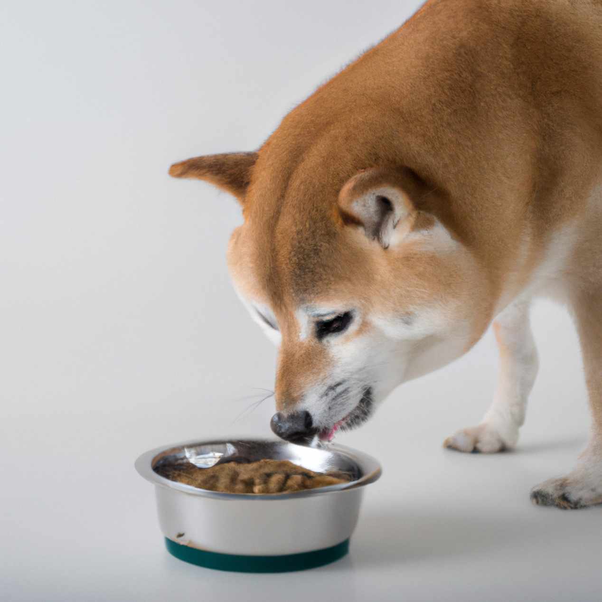

#

chatgpt(gpt-3.5), image(DALL・E) 使ってみる

```sh
cp .env.sample .env
```

https://platform.openai.com/account/api-keys から apikey 作成して.env 書き換え

```sh
# ndoe v18.14.2
npm i
```

実行

```sh
npm run start:dev
```

## chat

```
curl 'http://localhost:3000/chatgpt' \
--header 'Content-Type: application/json' \
--data '{ "message": "お前のこと誰が好きなん？" }'

> [
>   {
>     index: 0,
>     message: { role: 'assistant', content: '私は人工知能であり、感情や好き嫌いを持つことはできません。' },
>     finish_reason: 'stop'
>   }
> ]
```

## image

```
curl 'http://localhost:3000/images' \
--header 'Content-Type: application/json' \
--data '{ "content": "a photo of Shiba Inu eating food" }'
> 餌を食べている柴犬の写真
> 日本語が弱いっぽいので英語で

> {
>   created: xxxxxxxx,
>   data: [
>     {
>       url: 'https://oaidalleapiprodscus.blob.core.windows.net/private/xxxxxxxxxxxxxxx'
>     },
>     {
>       url: 'https://oaidalleapiprodscus.blob.core.windows.net/private/xxxxxxxxxxxxxxx'
>     }
>   ]
> }
```


